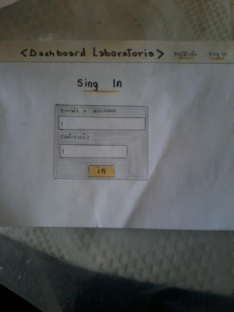
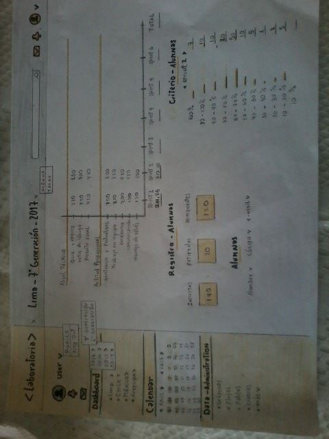
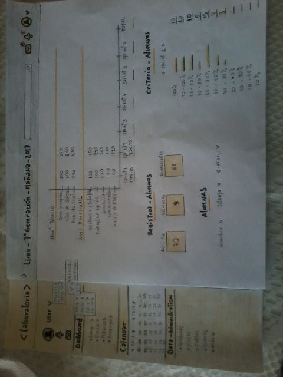
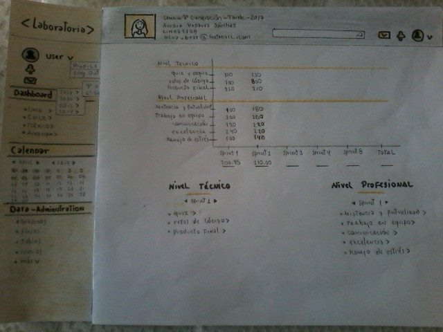

# Presentacion en sketch del dashboard de laboratoria

### En el presente dashboard, los usuarios de laboratoria pueden ver rápidamente estadísticas y datos en tiempo real como:

### de alumnas inscritas

### de alumnas que desertaron

### y % de alumnas que pasan el criterio mínimo de evaluación

### Promedio de notas por sprint

### Promedio de notas HSE(actitud profesional)

### Promedio de notas técnicas(nivel técnico)

### los datos que se ubican en el dashboard son editables por el usuario

### en el dashboard tambien se puede apreciar que la informacion se brindara por categorias, ya que laboratoria  trabaja con 2 generaciones por año (estas generaciones empezaron en el 2014), y  opera en 4 sedes (Arequipa, Ciudad de México, Lima y Santiago de Chile).

### por seguridad  solo el usuario podra acceder al dashboard al ingrear sus datos : pasword y contraseña.

### en el dahsboard se visualiza un buscador,para facilitar la busqueda al usuario y ejecutarlo a su manera.

###  en el dashboard tambien se tiene otras herramientas que puede utilizar el usuario como : perfil,notificaciones,mensajes,calendario,administracion de sus datos entre otros

